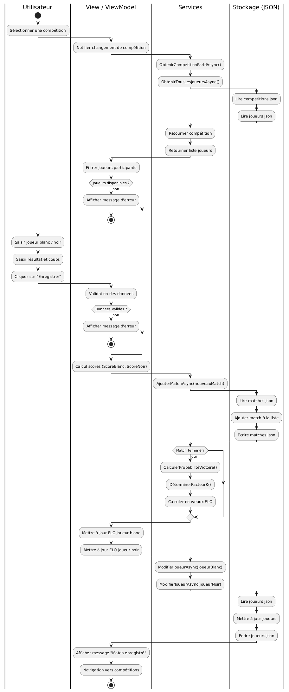

# Rapport de Conception : Système de Gestion de Compétitions d'Échecs

## Introduction et Contexte du Projet

Ce projet consiste en une application de bureau multiplateforme développée en C# avec le framework Avalonia UI, suivant l'architecture logicielle Model-View-ViewModel (MVVM).

L'objectif principal du système est de fournir à une fédération ou à un club d'échecs un outil pour centraliser la gestion de ses membres (joueurs) et des tournois (compétitions) qu'ils organisent.

Les fonctionnalités de base couvrent :

   - La gestion complète des joueurs (Ajout, Modification, Suppression, Affichage du classement ELO).

   - La gestion des compétitions (Création, Modification, Suppression, Ajout de joueurs participants).

   - La gestion des matchs (encodage des parties jouées durant les compétitions avec leurs coups et leurs résultats).

   - L'enregistrement persistant des joueurs, compétitions et matchs.

   - Actualisation du classement ELO après chaque match

Les données sont stockées de manière persistante dans des fichiers JSON gérés par une couche de services asynchrone.

## Fonctionnalité Supplémentaire Choisie

Le Tableau de Bord est conçu comme le centre de pilotage de la fédération. Au lieu de naviguer entre les différentes listes, il offre une vue d'ensemble immédiate et analytique de votre base de données :

    Indicateurs Clés (KPIs) : Il affiche des cartes visuelles résumant les statistiques globales : le nombre total de joueurs inscrits, le nombre de compétitions créées et le volume total de matchs enregistrés.

    Analyse de Performance : Il génère automatiquement un "Top 5" des meilleurs joueurs basé sur leur classement ELO actuel. Cela permet d'identifier instantanément les leaders de la fédération.

    Interface Réactive : Grâce à l'utilisation de ObservableCollection et des commandes asynchrones, les données se chargent de manière fluide sans bloquer l'interface, avec un indicateur visuel de chargement et un bouton de rafraîchissement manuel pour garantir que les informations sont toujours à jour.

C'est un outil stratégique qui transforme vos données brutes en informations exploitables pour le suivi de l'activité de votre fédération.

## Diagramme de classe 

### Description du diagramme de classes
Le diagramme illustre l'architecture complète de l'application selon le pattern MVVM :
- Couche Modèle : Les classes Joueur, Competition, Match et Coup héritent de l'interface Echec qui elle-même hérite de ISport, permettant une extensibilité vers d'autres sports.
- Couche Service : Les services (JoueurService, CompetitionService, MatchService) implémentent IService et gèrent la persistance des données dans des fichiers JSON. Le EloService implémente IRankingSystem pour permettre l'ajout d'autres systèmes de classement.
- Couche ViewModel : Les ViewModels orchestrent la logique métier en utilisant les services. Le MainViewModel gère la navigation entre les différentes pages de l'application.

## Diagramme de séquence

### Description du diagramme de séquence
Ce diagramme illustre le flux complet d'ajout d'un match avec mise à jour automatique des classements ELO :

- Sélection de la compétition : L'utilisateur choisit une compétition, ce qui déclenche le chargement des joueurs participants via le CompetitionService et le JoueurService.
- Saisie des informations : L'utilisateur sélectionne les deux joueurs (blanc et noir), saisit le résultat du match, les coups joués et d'éventuelles notes.
- Enregistrement du match : Le ViewModel valide les données, calcule les scores selon le résultat et enregistre le match via le MatchService.
- Mise à jour automatique des ELO : Si le match est terminé (résultat différent de "En cours"), le système 
appelle le EloService pour calculer les nouveaux ELO selon la formule FIDE , met à jour les deux joueurs dans la base de données via le JoueurService et afffiche un message de succès avec les nouveaux classements

Cette séquence met en évidence la séparation des responsabilités et l'utilisation de services spécialisés pour chaque type d'opération.

## Diagramme d'activité 

### Description du diagrame d'activité
Ce diagramme d'activité détaille le processus complet d'enregistrement d'un match au sein de l'application Projet-Chess_DB, de la sélection initiale de la compétition jusqu'à la mise à jour automatique du classement ELO.

Voici une description structurée des étapes clés du flux de travail :
1. Initialisation et Chargement des Données

Le processus débute lorsque l'Utilisateur sélectionne une compétition dans l'interface. Le ViewModel notifie alors le système de ce changement, déclenchant l'appel aux services ObtenirCompetitionParIdAsync() et ObtenirTousLesJoueursAsync(). Ces services extraient les données brutes des fichiers JSON (competitions.json et joueurs.json).
2. Sélection des Participants et Saisie

Le ViewModel filtre ensuite la liste globale pour ne proposer que les joueurs inscrits à la compétition sélectionnée.

    Contrôle de flux : Si aucun joueur n'est disponible, un message d'erreur est affiché et le processus s'arrête.

    Saisie utilisateur : L'utilisateur choisit les joueurs blanc et noir, saisit les coups de la partie, sélectionne le résultat (ex: "Blanc gagne", "Nul") et clique sur "Enregistrer".

3. Validation et Persistance du Match

Avant toute sauvegarde, le ViewModel effectue une validation des données saisies (champs obligatoires, joueurs différents). Si les données sont valides :

    Le système calcule les scores numériques (1, 0.5 ou 0) selon le résultat choisi.

    Le MatchService enregistre le match dans matchs.json via la méthode AjouterMatchAsync().

4. Calcul et Mise à Jour du Niveau ELO

Si le match est marqué comme terminé, le système déclenche automatiquement la logique de mise à jour du classement :

    L'EloService calcule la probabilité de victoire et détermine le facteur K (importance du match) pour les deux joueurs.

    Les nouveaux scores ELO sont calculés et appliqués aux profils des joueurs en mémoire.

5. Finalisation

Enfin, le JoueurService écrit les modifications de classement dans joueurs.json. L'application affiche un message de confirmation à l'utilisateur et le redirige vers la liste des compétitions.

## Justification des Qualités d'Adaptabilité à une Autre Fédération

Le projet est conçu avec une haute adaptabilité, ce qui le rend facilement transférable à une autre fédération ou à un autre sport basé sur un classement.

| Aspect du Projet |Justification de l'Adaptabilité | 
|--|-|
| Couche Modèles (Models) | L'utilisation de classes génériques comme Joueur, Competition, Match qui héritent de Echec (lui-même héritant de ISport) permet de facilement créer de nouveaux modèles pour un autre sport (ex: Football, Tennis) sans casser la structure de l'application. | 
| Couche Services (Services) | Les services sont indépendants de la logique métier spécifique. JoueurService gère le stockage des joueurs, quelle que soit la fédération. Seuls les noms des fichiers JSON devraient potentiellement être adaptés (joueurs_federation_x.json). | 
| Système de Classement (ELO) | Le système d'ELO est isolé dans l'interface IRankingSystem et sa seule implémentation, EloService. Pour changer de système (par exemple, vers le Glicko-2 ou un classement par points), il suffirait de créer une nouvelle classe implémentant IRankingSystem et de remplacer l'instance utilisée dans le ViewModel sans modifier le code de sauvegarde des joueurs. | 
| Interface Utilisateur (MVVM) | La séparation totale de l'UI et de la logique métier (MVVM) signifie qu'une nouvelle charte graphique ou une nouvelle langue peut être appliquée via les fichiers .axaml et les ressources sans toucher aux ViewModels ni aux Services. | 

## Principes SOLID Utilisés

Deux principes fondamentaux de conception orientée objet (SOLID) sont mis en œuvre dans le projet :

### 1. Principe de la Responsabilité Unique (Single Responsibility Principle - SRP) : 
| Description | Justification dans le Projet                                                                                                                                                                                                                            |
|--|---------------------------------------------------------------------------------------------------------------------------------------------------------------------------------------------------------------------------------------------------------|
| Une classe ne devrait avoir qu'une seule raison d'être modifiée. Cela signifie qu'elle ne gère qu'un seul aspect du système. | Ce principe est très bien respecté dans la séparation entre la Persistance, la Logique de Calcul et la Logique de Présentation (UI).                                                                                                                    |
| Séparation de la Persistance | Les classes de services (JoueurService, CompetitionService, MatchService) sont responsables uniquement des opérations CRUD (Créer, Lire, Mettre à jour, Supprimer) sur leurs fichiers JSON respectifs. Elles n'effectuent aucun calcul métier complexe. |
| Séparation de la Logique de Calcul | Le EloService a pour seule responsabilité le calcul mathématique des nouveaux classements ELO. Il ne s'occupe ni de la sauvegarde des joueurs, ni de l'affichage.                                                                                       |
| Séparation de la Présentation | Le ViewModel (comme AjouterMatchPageViewModel) gère l'état de la vue (boutons, messages) et coordonne les appels aux autres services. Il ne contient pas la logique de lecture JSON ou de calcul ELO.                                                   |
#### Bénéfice : 
Si vous décidez de passer d'un stockage JSON à une base de données SQL, seul le code des classes *Service.cs (JoueurService, CompetitionService et MatchService) sera modifié. Le EloService et les ViewModels resteront inchangés
### 2. Principe Ouvert/Fermé (Open/Closed Principle - OCP)
| Description | Justification dans le Projet                                                                                                                                                                                                                                                                     | 
|--|--------------------------------------------------------------------------------------------------------------------------------------------------------------------------------------------------------------------------------------------------------------------------------------------------|
| Les entités logicielles doivent être ouvertes à l'extension, mais fermées à la modification. Cela signifie qu'on ajoute des fonctionnalités par extension (héritage ou implémentation d'interface), et non en modifiant le code existant qui fonctionne. | Ce principe est bien appliqué au niveau du système de classement                                                                                                                                                                                                                                 | 
| Ouvert à l'Extension | L'interface IRankingSystem a été créée. Si vous souhaitez changer le système de classement d'Échecs (par exemple, passer de la formule FIDE à une autre méthode, comme Glicko-2), vous pouvez créer une nouvelle classe (GlickoService) qui implémente IRankingSystem                            | 
| Fermé à la Modification | Tout le code des ViewModels ou des Services de persistance qui appelle le classement (comme AjouterMatchPageViewModel via MettreAJoursAsync) reste fermé à la modification. Il s'attend à recevoir une implémentation de IRankingSystem et n'a pas besoin de savoir quelle formule est utilisée. | 
#### Bénéfice : 
Vous pouvez étendre le nombre de systèmes de classement disponibles sans modifier le code qui gère l'enregistrement d'un match.

## Conclusion

Le projet Chess D.B. établit un système solide de gestion des données de compétitions d'échecs. L'adoption de l'architecture MVVM avec le framework Avalonia UI assure une séparation nette entre l'interface et la logique. L'intégration de l'automatisation du classement ELO, soutenue par les principes SOLID de Responsabilité Unique et le Principe Ouvert/Fermé, rend le système non seulement fonctionnel, mais également maintenable, évolutif et adaptable à de nouvelles règles de jeu ou à d'autres fédérations sportives utilisant un système de classement dynamique.